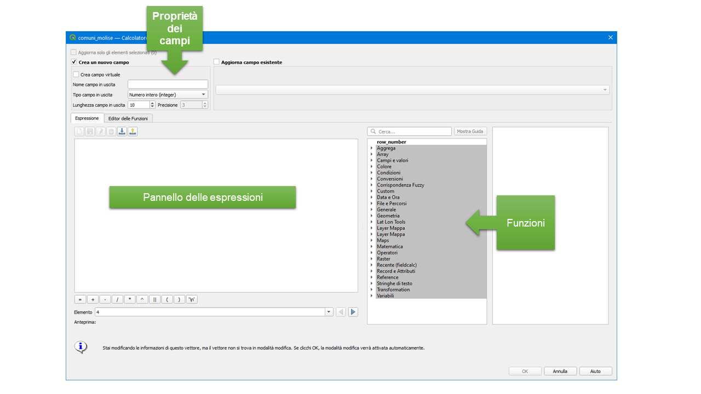
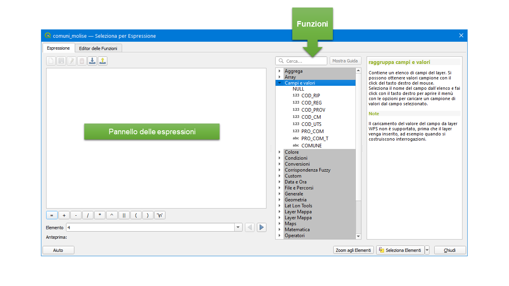
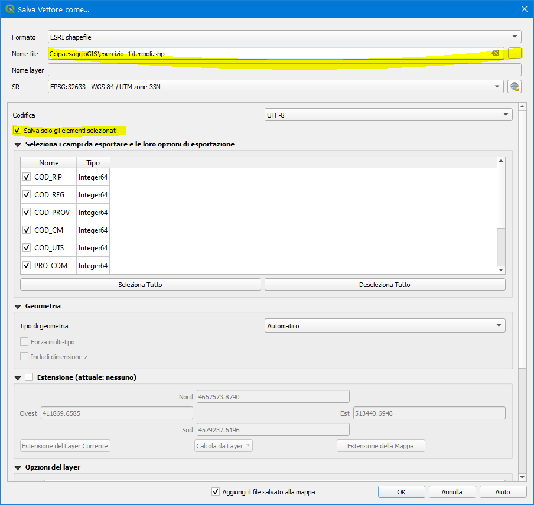

# Esercitazione #1 - Gestione dei dati vettoriali

## Overview
In questo esercizio imparerai a caricare un dataset vettoriale, esplorare la tabella attributi e utilizzare i dati contenuti per tematizzare il dataset. Nella seconda parte dell'esercizio imparerai ad effettuare delle queries sia spaziali che non spaziali e ad esportare il dataset selezionato.

[Download del Dataset](https://github.com/Envixlab/paesaggioGIS/raw/master/dataset/esercitazione_1.zip)
## Parte 1: caricamento del dataset vettoriale comuni_molise
### Caricamento del dataset
Creare una cartella \paesaggioGIS\esercizio_1 nel percorso C:\paesaggioGIS\esecizio_1 e copiare all'interno il dataset comuni_molise (.shp, .shx, .dbf, .prj). Aprire QGIS, creare un nuovo progetto e salvarlo nella cartella appena creata.
In QGIS cliccare su `Layer -> Aggiungi Layer -> Aggiungi Layer Vettore` , navigare nell'apposita cartella e caricare il dataset comuni_molise [link al tutorial](./materiale/tutorial/caricamento_vettoriali/index).

Utilizzare gli strumenti di pan e zoom per prendere confidenza con gli strumenti di QGIS. Per aprire la tabella attributi cliccare sull'icona `Apri Tabella Attributi` oppure cliccare il tasto `F6`. Esplorare la tabella attributi.

### Vestizione o tematizzazione del dataset
Vestire o tematizzare un dato significa assegnare colori differenti alle geometrie del dato sulla base delle caratteristiche contenute nella tabella attributi, al fine di evidenziare un fenomeno.
Nel caso in esame, si vugliono rappresentare i comuni del molise in base alla provincia di appartenenza. Nella tabella attributi è presente il campo `COD_PRO` i cui valori identificano la provincia:

* `COD_PRO = 94` Isernia
* `COD_PRO = 70` Campobasso

Per modificare lo stile del dataset cliccare su `Apri il pannello Stile Layer`  oppure premere il tasto `F7` oppure cliccare nel pannello dei layer sul nome del dataset, tasto destro, proprietà, selezionare la scheda `Simbologia`.

Esistono diversi tipi di tematizzazione; i più utilizzati sono:

* `Simbolo singolo` (default): assegna lo stesso colore a tutte le geometrie del layer;
* `Categorizzato`: crea delle categorie di valori utilizzando un campo della tabella attributi (si applica a valori qualitativi);
* `Graduato` : crea delle classi sulla base di un campo con valori numerici (si applica a valori quantitativi).

Il campo `COD_PROV` pur essendo di tipo numerico, esprime in realtà una qualità (una categoria). Andrà quindi utilizzato il metodo `categorizzato`.

Per approfondire l'argomento si può consultare [l'estratto del libro "Esercizi svolti in QGIS"](https://www.darioflaccovio.it/index.php?controller=attachment&id_attachment=648)

## Parte 2: Analisi vettoriali e Query
### Caratteristiche geometriche
#### Calcolo della superficie dei comuni mq.
Aprire il `calcolatore di campi` utilizzando l'apposito comando `Apri Calcolatore di Campi` .

* `Crea un nuovo campo`
* `Nome campo in uscita`: sup_mq
* `Tipo di campo`: Numero intero
* `Lunghezza campo in uscita`: 10

Cercare tra le funzioni di geometria la funzione `$area` e premere ok. Valutare il risultato in tabella attributi.
#### Conversione della superficie in kmq.
Nel calcolatore campi
* `Crea un nuovo campo`
* `Nome campo in uscita`: sup_kmq
* `Tipo di campo`: Numero intero
* `Lunghezza campo in uscita`: 10

Scrivere nella finestra delle espressioni:
`"sup_mq"/1000000`

Premere ok e valutare il risultato nella tabella attributi.

### Selezione non spaziale
La selezione non spaziale sfrutta i valori dei campi della tabella attributi per operare le selezioni. In QGIS cliccare su `Seleziona Elementi usando un'espressione`  oppure premere la combinazione di tasti `Ctrl`+`F3`

Per selezionare un valore specifico, l'operatore da utilizzare è `=`. Ad esempio, se si vuole selezionare il comune di Termoli bisonga digitare:

`COMUNE='Termoli'`

Una volta selezionato, la geometria selezionata apparirà di colore giallo e il corrispondente record nella tabella attributi apparirà in blu. Per esposratre la geometri selezionata e creare un nuovo dataset, cliccare con il tasto destro su `comuni_molise`, `Esporta`, `Salva elementi selezionati come`:

Per deselezionare la selezione in corso premere `Deseleziona Elementi` 

Una query può interrogare contemporeanamente più caratteristiche del database, utilizzando gli operatori Booleani `AND`, `NOT`, `OR` e `XOR`.

Selezione di più comuni:

`COMUNE='Termoli' OR COMUNE='Isernia'`

Selezione di un comune della provincia di Isernia e di tutti i comuni della provincia di Campobasso:

`COMUNE='Miranda' OR COD_PROV=70`

Selezione di tutti i comune della provincia di Campobasso con superficie inferiore a 25 kmq:

 `"COD_PROV"  =  70 AND  "sup_kmq < 25`

Seleziona i comuni della provincia di Isernia con superficie non maggiore di 50 kmq:

 `"COD_PROV"  =  94  AND NOT "sup_kmq" > 50`

### Selezione spaziale
Caricare il dataset vettoriale SIC_Molise. Utilizzare il comando `Selezione per posizione` 

Selezionare tutti i comuni che ricadono in zone SIC:

* `Seleziona elementi da` : comuni_molise
* `Dove gli elementi`: interseca
* `Rispetto agli elementi`: SIC_Molise
* `Modifica la selezione corrente con`: creazione nuova selezione in corso

Selezionare i comuni completamente compresi in zone SIC:

* `Seleziona elementi da` : comuni_molise
* `Dove gli elementi`: sono contenuti
* `Rispetto agli elementi`: SIC_Molise
* `Modifica la selezione corrente con`: creazione nuova selezione in corso

Selezionare i comuni che contegono interamente un SIC all'interno della propria estensione:
* `Seleziona elementi da` : comuni_molise
* `Dove gli elementi`: contiene
* `Rispetto agli elementi`: SIC_Molise
* `Modifica la selezione corrente con`: creazione nuova selezione in corso
