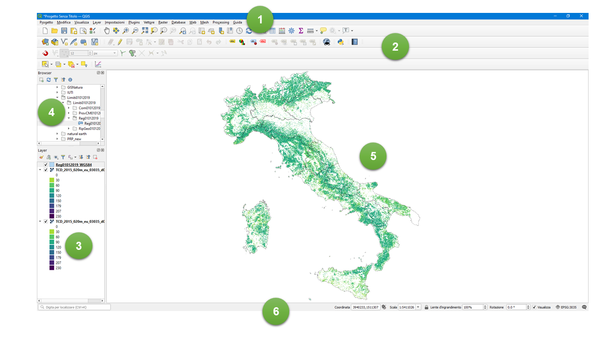

# GUI (Graphical User Interface) di QGIS



1. Map Canvas
2. Pannello dei Layer: nei GIS i dati geografici (sia raster che vettoriali) vengono gestiti secondo la struttura dei layer (o strati). Un layer può contenere un solo tipo di dato (es. puntuale, lineare, areale, raster)
3. Pannello del browser: permette di navigare nelle cartelle del computer
4. Barra degli strumenti
5. Barra di stato


## Istruzioni per Windows

Per gli utenti Windows esiste la possibilità di scaricare la versione Standalone installer che scarica QGIS con tutto il necessario per il funzionamento e l'OSGeo4W Network Installer che invece permette di selezionare quali pacchetti installare e di scaricare applicativi aggiuntivi (per utenti avanzati).

Si consiglia di scaricare la versione Standalone a lungo supporto. Prima di scaricare bisogna verificare l'archiettura del Sistema Operativo (32 bit o 64 bit). Per la verifica, recarsi nel **Pannello di controllo**, cliccare su **Sistema e sicurezza**, **Sistema** e verificare la versione in **Tipo di sistema**.


## Istruzioni per Linux (Distribuzioni Debian/Ubuntu)

Aggiungere alla fine del file le seguenti linee

```
sudo nano /etc/apt/source.list
```

```
#QGIS 3.16
deb https://qgis.org/ubuntu-ltr codename main
deb-src https://qgis.org/ubuntu-ltr codename main
```

Sostituire codename con la versione di ubuntu/debian in possesso (es. bionic, xenial, focal, ...)

Aggiornare i pacchetti di ubuntu/debian e installare QGIS

```
sudo apt update
sudo apt-get install qgis python3-qgis qgis-plugin-grass
```

In caso di errori al server delle chiavi, aggiungere la chiave pubblica del repository di QGIS e reinstallare.

```
wget -O - https://qgis.org/downloads/qgis-2020.gpg.key | gpg --import
gpg --fingerprint F7E06F06199EF2F2
```

```
gpg --export --armor F7E06F06199EF2F2 | sudo gpg --no-default-keyring --keyring gnupg-ring:/etc/apt/trusted.gpg.d/qgis-archive.gpg --import
sudo chmod a+r /etc/apt/trusted.gpg.d/qgis-archive.gpg
```

## Istruzioni per Mac OS

Sul sito di QGIS sono presenti gli installer pronti per le versioni del sistema operativo MacOS. Valgono le stesse considerazioni fatte per windows ossia l'installazione della versione LTR.
