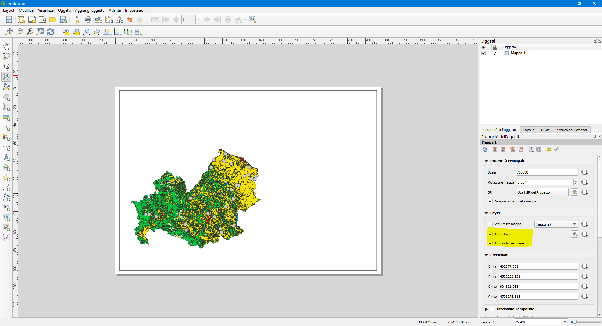
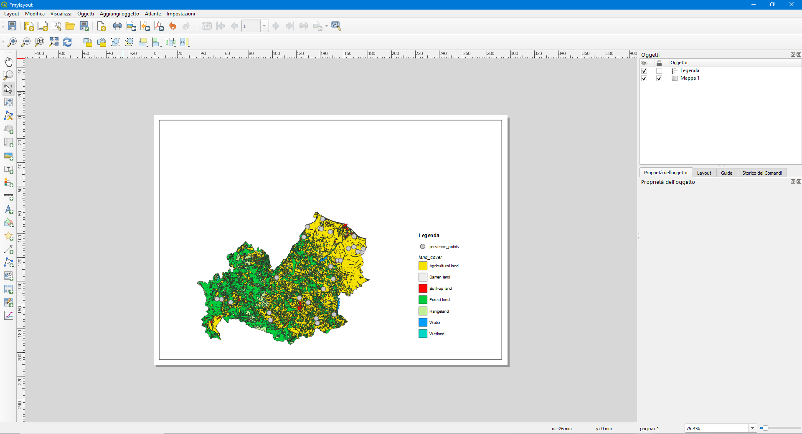
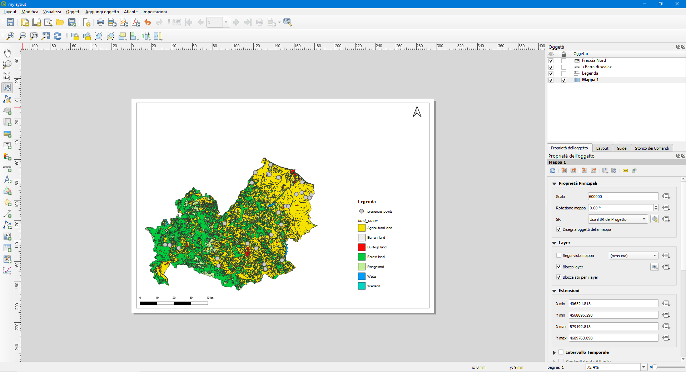
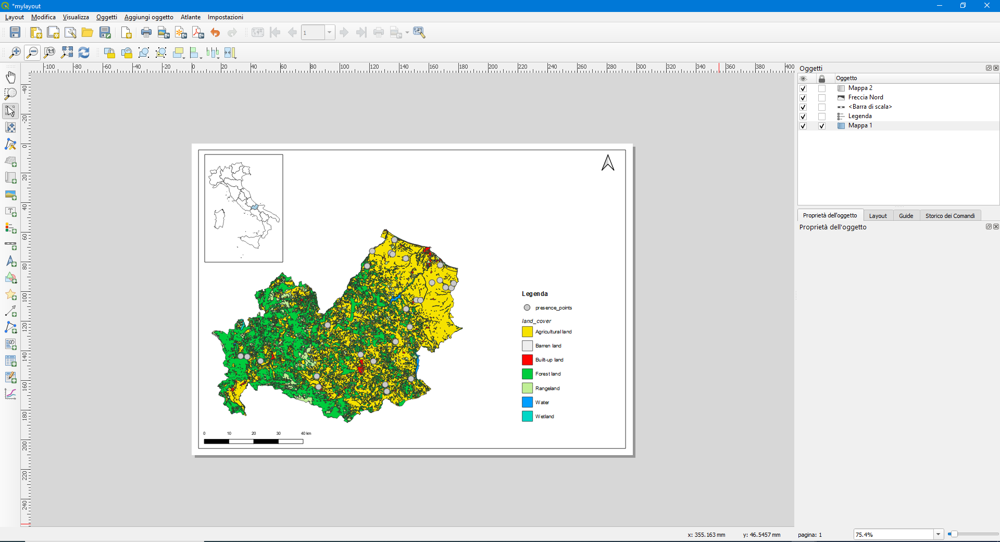
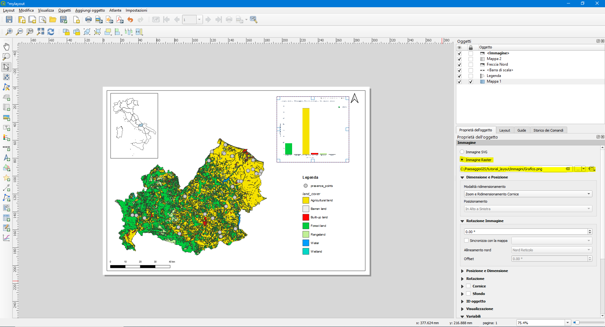
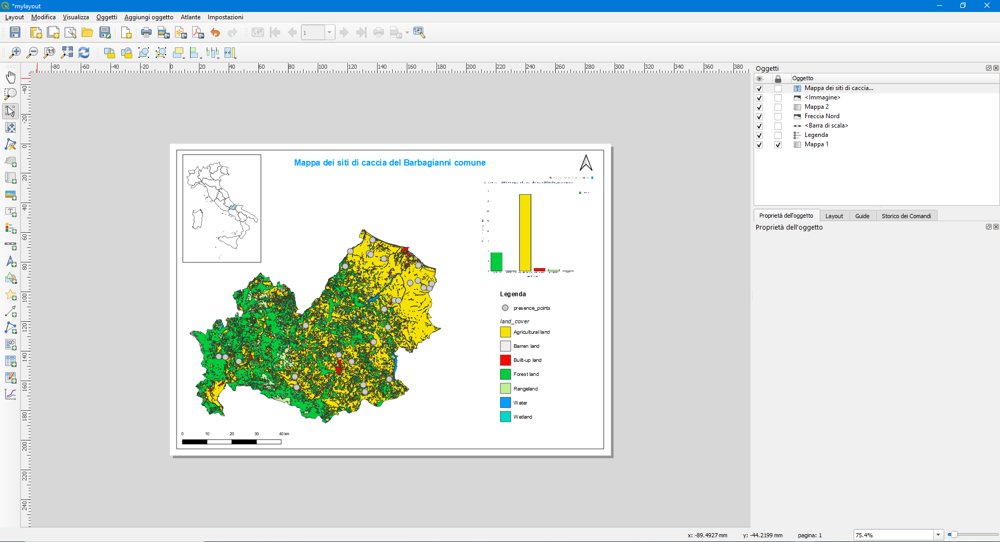

# Layout di stampa
Il Layout di stampa permette di esportare le mappe prodotte in un progetto QGIS. Per aprire un nuovo layout di stampa cliccare su `Progetto` -> `Nuovo Layout di Stampa` inserire un titolo come ad esempio `mylayout` e cliccare su `ok`. E' possibile accedere al layout di stampa appena creato cliccando su `Progetto` -> `Layout`.

In questo tutorial utilizzeremo il progetto creato nell'Esercitazione#3, già tematizzato e pronto all'utilizzo scaricabile al seguente [link](https://github.com/Envixlab/dataset_paesaggioGIS/raw/main/dataset/tutorial_layout.zip).

### Creare un nuovo Layout di stampa

1. `Barra degli Strumenti`: contiene gli strumenti per aggiungere mappa, legenda, testi, barra di scala, immagini, ecc.;
2. `Barra del Layout`, `Barra dell'Atlante`, `Barra di Navigazione`, `Barra delle Azioni`;
3. `Pagina`;
4. `Pannelli`: il `Pannello oggetti` permette di modificare le impostazioni degli oggetti della mappa.

Il `Layout di Stampa` utilizza una struttura ad oggetti: ogni elemento caricato nel layout costituisce un oggetto (mappe, legende, immagini, ecc.). Il `Layout di Stampa` e il `Map Canvas` sono collegati, di default, in maniera dinamica: i contenuti visualizzati nel `Map Canvas` vengono visualizzati nel `Layout di Stampa`. Ne deriva che la prima operazione da compiere è quella di tematizzare e impostare la visualizzazione desiderata dei dati nel `Map Canvas`.

### Aggiungere una Mappa
Per aggiunere la mappa al layout cliccare su `Aggiungi Mappa` , posizionarsi nell'angolo in alto a sinistra del layout, cliccare con il tasto sinistro e tenendo premuto spostarsi nell'angolo in basso a destra e rilasciare il pulsante del mouse.

* Per selezionare e spostare gli oggetti premere il pulsante `Seleziona/Sposta oggetto` .
* Per spostare il contenuto della mappa utilizzare il comando `Sposta il contenuto dell'oggetto` 

Quando si aggiunge un nuovo oggetto quest'ultimo verrà aggiunto al `Pannello oggetti` e sarà possibile modifcarne le caratteristiche. Aggiungendo la mappa si creerà in automatico l'oggetto `Mappa 1`.

Ai fini dell'esercitazione impostare una scala uguale a 600000 e aggiungere una cornice. Quando si è soddisfatti del proprio risultato si può bloccare l'oggetto Mappa per evitare modifiche indesiderate, spuntando il simbolo di lucchetto nel `Pannello oggetti`.

#####Nota bene
Come detto in precedenza, `Layout di Stampa` e `Map Canvas` sono collegati dinamicamente. Per bloccare la mappa sulla vista attuale, cliccare su `Blocca layer` e `Blocca stili per i layer` per "congelare" i layer e gli stili attuali.

### Aggiungere una Legenda
Per aggiungere la legenda al layout cliccare su `Aggiungi Legenda` 
Di default la legenda mostra tutte le simbologie presenti nel `Map Canvas`, anche le non visibili (nel file di eserictazione mostra anche la simbologia delle Regioni). Per filtrare solo i layer presenti nel layout, andare nelle proprietà della legenda, `Oggetti Legenda` e spuntare `Mostra solamente oggetti all'interno della mappa collegata`. Di una legenda si possono impostare il titolo, regolare dimensioni, spaziatura, caratteri, ecc. Una volta elaborata la legenda si può bloccare come per la mappa, spuntando il simbolo di lucchetto nel `Pannello oggetti`.

### Aggiungere altri elementi della mappa
Altri elementi da inserire in una mappa sono la `Barra di scala`  e l'indicazione del nord cartografico 

### Aggiungere una seconda mappa
Quando si rappresenta una mappa di un territorio è buona norma inquadrare il territorio in un contesto più ampio, come quello nazionale. Si può aggiungere una seconda mappa che riporti, ad esempio, la localizzazione della Regione Molise. A tal proposito utilizzeremo il layer Regioni.

Prima di aggiungere una seconda mappa, andare nel `Map Canvas`, spegnere i layer presence_points e land cover e spuntare il layer Regioni. **Importante**: assicurarsi che l'oggetto `Mappa 1` sia ["congelato"](#Nota-bene).

Per aggiungere una seconda mappa cliccare su `Aggiungi Mappa` , impostare una scala idonea (es. 20000000) e una cornice.

### Aggiungere un'immagine
Per aggiungere un'immagine cliccare su `Aggiungi Immagine` , posizionarsi nell'angolo in alto a destra del layout, cliccare con il tasto sinistro e tenendo premuto spostarsi in diagonale e rilasciare il pulsante del mouse. L'oggetto `Immagine` viene creato in automatico nel `Pannello oggetti`. Per caricare un'immagine, nelle proprietà dell'oggetto `Immagine`, spuntare `Immagine Raster` e selezionare il percorso contenente l'immagine da caricare `(./immagini/Grafico.png)`

### Aggiungere un titolo
Per aggiungere una casella di testo cliccare su `Aggiungi Etichetta` . L'oggetto `Testo` viene creato in automatico nel `Pannello oggetti`. Modificare il testo di deafult, il carattere, la dimensione, ecc.

### Esportare la Mappa
Per esportare la mappa `Layout` -> `Esporta come Immagine` oppure `Esporta come PDF` e salvare nella cartella layout.
