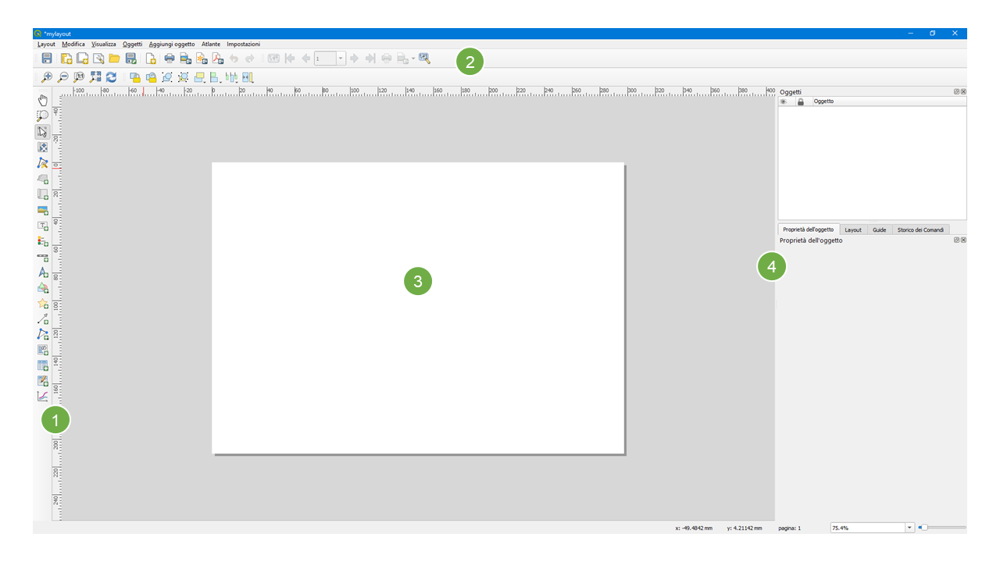

# Layout di stampa
Il Layout di stampa permette di esportare le mappe prodotte in un progetto QGIS. Per aprire un nuovo layout di stampa cliccare su `Progetto` -> `Nuovo Layout di Stampa` inserire un titolo come ad esempio `mylayout` e cliccare su `ok`. E' possibile accedere al layout di stampa appena creato cliccando su `Progetto` -> `Layout`.

In questo tutorial utilizzeremo il progetto creato nell'Esercitazione#3, già tematizzato e pronto all'utilizzo scaricabile al seguente [link](https://github.com/Envixlab/dataset_paesaggioGIS/raw/main/dataset/tutorial_layout.zip).

Creare un nuovo Layout di stampa.

1. `Barra degli Strumenti`: contiene gli strumenti per aggiungere mappa, legenda, testi, barra di scala, immagini, ecc.;
2. `Barra del Layout`, `Barra dell'Atlante`, `Barra di Navigazione`, `Barra delle Azioni`;
3. `Pagina`;
4. `Pannelli`: il `Pannello oggetti` permette di modificare le impostazioni degli oggetti della mappa.

Il `Layout di Stampa` utilizza una struttura ad oggetti: ogni elemento caricato nel layout costituisce un oggetto (mappe, legende, immagini, ecc.). Il `Layout di Stampa` e il `Map Canvas` sono collegati, di default, in maniera dinamica: i contenuti visualizzati nel `Map Canvas` vengono visualizzati nel `Layout di Stampa`. Ne deriva che la prima operazione da compiere è quella di tematizzare e impostare la visualizzazione desiderata dei dati nel `Map Canvas`.

Per aggiunere la mappa al layout cliccare su `Aggiungi Mappa` , posizionarsi nell'angolo in alto a sinistra del layout, cliccare con il tasto sinistro e tenendo premuto spostarsi nell'angolo in basso a destra e rilasciare il pulsante del mouse.

* Per selezionare e spostare gli oggetti premere il pulsante `Seleziona/Sposta oggetto` .
* Per spostare il contenuto della mappa utilizzare il comando `Sposta il contenuto dell'oggetto` 

Quando si aggiunge un nuovo oggetto quest'ultimo verrà aggiunto al `Pannello oggetti` e sarà possibile modifcarne le caratteristiche.

Ai fini dell'esercitazione impostare una scala uguale a 700000 e aggiungere una cornice. Quando si è soddisfatti del proprio risultato si può bloccare l'oggetto Mappa per evitare modifiche indesiderate, spuntando il simbolo di lucchetto nel `Pannello oggetti`.

