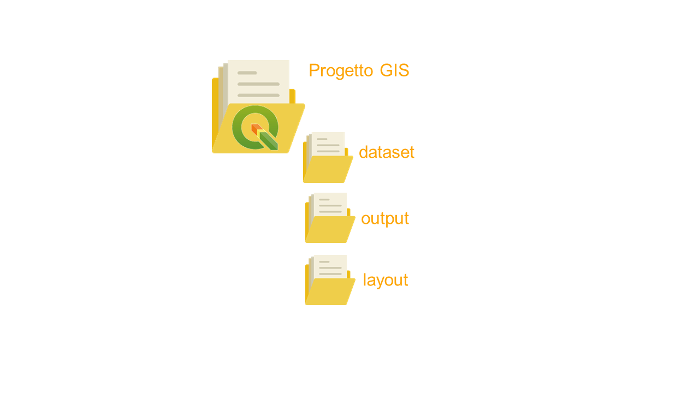

# Organizzare un progetto GIS: files e directories
In QGIS, ma in quasi tutti i software GIS, il progetto è il modo con cui i dati vengono organizzati, elaborati e visualizzati. Un progetto può essere **collegato** con differenti dataset e un stesso dataset può essere richiamato all'interno di più progetti.

E' buona norma, soprattutto per chi è alle prime armi con i software GIS, organizzare il progetto in modo che i collegamenti con i dati non si perdano: se si sposta il progetto o un file ad esso collegato, il progetto non funzionerà più in maniera corretta.

Un possibile modo di organizzare il lavoro è il seguente:

* Creare una cartella di progetto evitando nomi con caratteri speciali, spazi, ecc., all'interno di un percorso breve come nel disco `C:\progetto1`

* Creare all'interno della cartella `progetto1` una sottocartella chiamata `dataset`. All'interno di `C:\progetto1\dataset\` copiare i incollare i dataset (vettoriali e raster) utili ai fini del progetto

* Creare una sottocartelle in `C:\progetto1\` chiamata `output` dove si andranno a salvare i file creati in seguito alle elaborazioni

* Creare una sottocartella in `C:\progetto1\` chiamata `layout` dove si andranno a salvare i layout di stampa

